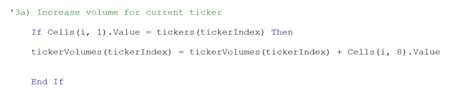

# Stock-Analysis

## The Refactored Code Analysis Module 2

## Overview of Project
The purpose of this analysis is to determine if refactoring the Module 2 solution code will successfully make the VBA script run faster. Steve really enjoyed the work we did for him on the Module 2 Analysis. We wrote VBA code to calculate the total daily volume and yearly return for specific stocks.  Steve is now looking to expand his research for his parents, and he is looking to expand to potentially thousands of stocks. This task may be done with the code we created but it’s not the most efficient approach. We want to help Steve provide the best work he can for his parents. We are going to make changes to the existing code, so it is well suited for more data. 
We will use the code from Module 2 and make changes to it to increase its efficiency. Refactoring is a vital skill for coding which is intended to make the output of the code more suitable for the task. With refactoring we can edit the logic of the existing code or use less memory to allow the system to process faster. A great approach when interacting with multiple tables is to reduce steps that require the code to copy data from a sheet and paste to another one. A great technique to include involves looping and storing data to later output which is a lot faster. Refactoring code is an ideal tool for an analyst because it allows us to learn how to leverage existing coding logic to fit our current problem instead of potential wasting time attempting to create new.	
In the first module 2 code we looped through each ticker and stored the total Volume, starting Price, and ending Price into those variables for each ticker. After we captured the total Volume, starting Price, and ending Price for the first ticker we output the total Volume, starting Price, and ending Price for this ticker into the cells in the “All Stocks Analysis” sheet. In each loop for each ticker after the code looped through each row of data for that specific ticker it pastes the values into our “All Stocks Analysis” sheet.  In this approach the code must gather the information for “AY” which was the first ticker. After the first ticker data is collected, the code tells VBA to transition over to the “All Stocks Analysis” tab. This step causes more time for the code to jump between sheets. After VBA is in the correct sheet the data is placed into the columns for total Volume, starting Price, and ending Price. This method causes the code to make updates to the “All Stocks Analysis” sheet for each ticker each time. The data is pasted into the sheet after looking at the “Year” we are looking for but this although faster with VBA is still a slow process. This process must loop through the sheet 12 times for each ticker and through all the rows. 

##### Three output arrays for looping through the values and storing the data

The more efficient approach, and the ideal method is to only interact with each sheet the least number of times. The key is to loop through the data and hold the information for each ticker once and then output into the “All Stocks Analysis” sheet. In the refractored code we create 3 output arrays so that when the code loops through the “Years” sheet, it pulls the data for each ticker once. After the code runs through all the rows for each ticket we output the data into the “All Stocks Analysis” sheet and the code is done. Below are screen shots of how long it took each job to run. 

Ticker Volumes Output array

##### Ticker Starting and Ending Prices Output array

In the first example that is labeled “Module 2 -2017” this shows us how long it took the code to run through each ticker, output the results into the “All Stocks Analysis” sheet. In this process the code and interaction with the “All Stocks Analysis” sheet takes 1 second for 2017. When the code is ran using the refactored code and the output arrays for each When the code is running for total Volume, starting Price, and ending Price. The code runs through each row for each ticker and only interacts with the “All Stocks Analysis” sheet once. The time it takes for the refactored code for 2017 is 0.168 seconds. Adding the output arrays decreased the time it takes to perform the same task 0.8046875 seconds faster. Looking at the times for the old code Module 2 -2018, still using the initial code, the output runs 1.13 seconds. Using the refactored code, the time decreases to 0.168 which is .962 seconds faster than the original code. 

##### Module2_VBA_Script- 2017 (Left) Vs Module 2 – 2017 -Refactored (Right)

##### Module2_VBA_Script- 2018 (Left) vs Module 2 – 2018 -Refactored (Right)

 

## Advantages or disadvantages of refactoring code
Looking at the results of the refactored code I believe the advantages are that the code runs a lot faster. I think this is great because when using VBA, the benefit is that the results are delivered timely. This will be very helpful for Steve when assisting his parents in their efforts to analyze more stocks to find the best ticker for their needs. This supports the idea that the code while faster is also more efficient. Both codes deliver the correct results but having code that deliver faster but more efficient results is more appealing when creating solutions for clients. I think another advantage to the refactored code is that it provides more flexibility to research more data. If using the code from the initial Module2_VBA_Script is less suitable when looking at the refactored code. My point is that with the refactored and the output arrays we could use that stored data in other sheets and build better reports to show how each stock performs among the others. The initial Module2_VBA_Script outputs the data after running 12 times but the refactored data can store the results for later use, there is more versatility to use the data in unique dashboards because the results can be stored for later use. I don’t see any disadvantages to using the refactored code verse the initial Module2_VBA_Script.

## Pros and Cons apply to refactoring the original VBA script
The pro for the refactored script is that it provides a more useful approach to researching stock tickers. The refactored code with the conditional formatting helps your eyes make a distinction between the good performing and lower performing stocks. The code helps do the hard work so the end user can spend more time researching stocks to find their best ones. Refactoring gives you the ability to create a custom code that is subtle for the task and capable of providing additional leverage like the ability to view more data in a shorter timeframe. If I had to develop a con for the refactored code, I would say that it takes more time to develop. This may be a negative depending on the time you need to provide a solution to a problem. So, in other words if Steve’s parents needed something that worked in a shorter amount of time, refactoring may take longer to develop. In the same conclusion I’d have to say that the functional increase in performance that the refactored code provides is worth the extra time spent. This new improved code gives the ability to expand the data.  The initial Module2_VBA_Script was good for one job, but the new refactored script has multiple uses and can be expanded to other areas of research.

